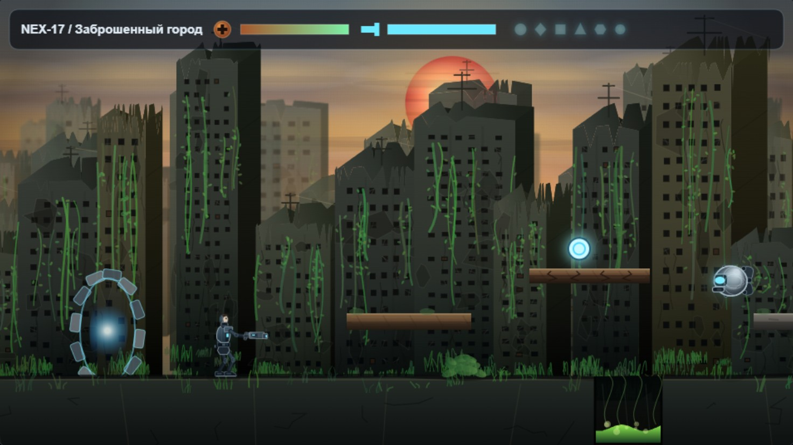
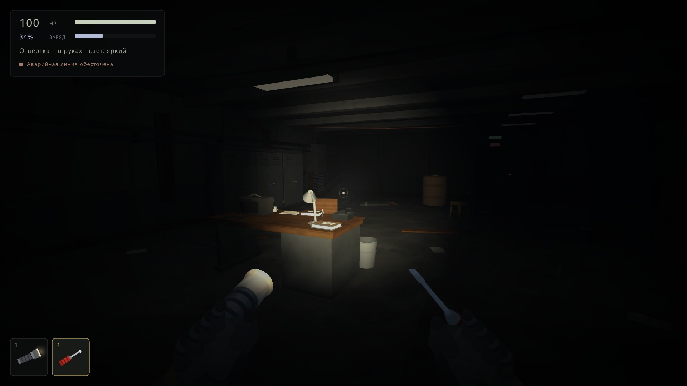
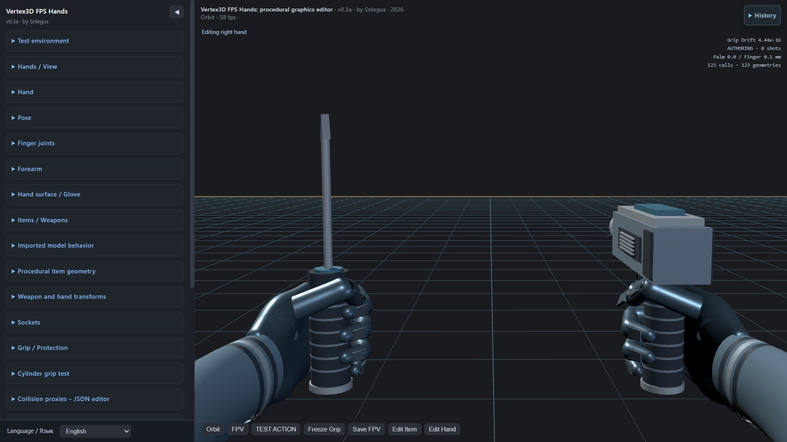
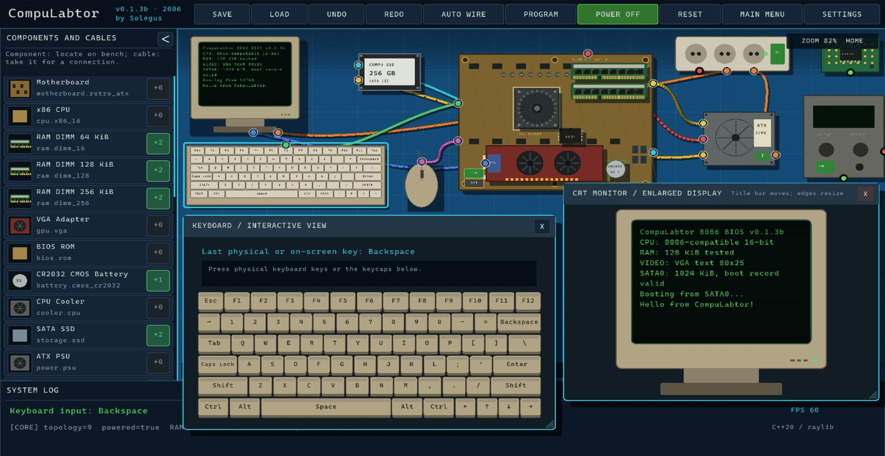
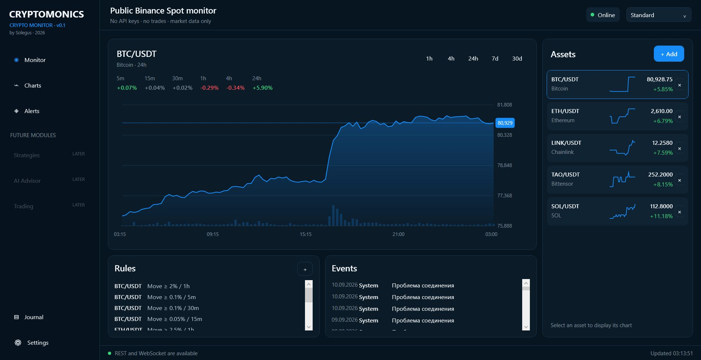

# Solegus

**Independent video game and software developer.**
Procedural graphics, virtual simulations, native tools, web experiments and development using state-of-the-art AI technologies.

**SHONexus** is my developing umbrella for game, software, simulation, and technical projects.

## Projects

### Planetary Frontiers

**2D action-adventure / platformer · HTML5 / CSS / JavaScript / Canvas / Web Audio API**

  

    
  

  

Original 2D action-adventure/platformer built on HTML/CSS/JavaScript/Canvas/Web Audio API with procedural graphics and sound. In the distant future, Earth researcher Nich Ozimov is thrown through a wormhole into unknown space, exploring uncharted worlds, gathering technology, fighting machines and aliens, and opening new portals to survive.

*Status: in development · Source repository: private*

---

### Hidden Complex

**3D first-person survival horror / adventure / quest · C++17 / raylib · Windows**

  

    
  

  

An intimate-scale 3D first-person survival horror/adventure/quest for Windows, built with C++17 + Raylib and realistic physics. In the 1990s, a radio amateur follows an unusual signal to an abandoned post-Soviet radar complex, becomes trapped inside, and discovers a secret alien presence on Earth while exploring its technical spaces.

*Status: in development · Source repository: private*

---

### Solar Vortex

**Experimental 3D sci-fi FPS · HTML5 / Three.js**

An experimental HTML5/Three.js 3D FPS sci-fi shooter with a vertical slice from shuttle and orbit to seamless landing and missions on an open planet. Procedural geometry, audio and advanced FPS hands from the custom Vortex3D FPS Hands graphic editor combine with cold retrofuturism, blaster combat, swarms of mechanical Sectators and bosses.

*Status: in development · Source repository: private*

---

### Vortex3D FPS Hands

**Procedural FPV hand editor · HTML5 / Three.js / WebGL**

  

    
  

  

Vortex3D FPS Hands is a unique and specialized graphical web editor for procedural 3D FPV hands built with HTML5/Three.js/WebGL and no premade hand models. It features unified organic geometry, poses and grips, FPV preview, weapon/tool integration, collision checks, JSON preset import/export, and reusable configurations for game projects.

*Status: in development · Source repository: private*

---

### CompuLabtor

**Native 2D PC simulator · C++20 / raylib / CMake · Windows**

  

    
  

  

CompuLabtor is a technically faithful native 2D PC simulator for Windows built with C++20/raylib/CMake. Users emulate assembly of x86 and other systems, including retro consoles, boot them through BIOS, write and execute code on a virtual CPU, and receive output through a GPU and monitor. Project goal: run Doom code inside the VM.

*Status: in development · Source repository: private*

---

### Cryptomonics

**Crypto market monitor and trading-assistant architecture · C# / .NET 10 / WPF / MVVM / SQLite · Windows**

  

    
  

  

Cryptomonics is a compact Windows crypto market monitor built with C#/.NET 10, WPF/MVVM and SQLite, using public Binance REST/WebSocket data for prices, trends, charts, tray alerts and market-noise filtering. Its architecture is designed for strategies, Paper Trading, private API, Risk Engine, AI Advisor and user-controlled trade execution.

*Status: in development · Source repository: private*

---

### The X-Files: Resist or Serve – Windows Port

**Native Windows port research · PlayStation 2 reverse engineering / Win64**

The X-Files: Resist or Serve – a research project for native porting of the 2004 PS2 game to modern Windows. Disc auditing, reverse engineering of code and formats, engine subsystem reconstruction, and a Win64 backend for graphics, audio, input, files and timing – without emulation, with parity testing, original fidelity and remastering potential.

*Status: research and development · Source repository: private*

---

## Development approach

My projects combine traditional software and video game development with procedural systems, reverse engineering, simulation, rapid prototyping, and development using advanced artificial intelligence systems. Public information about the projects is presented here, while the source code currently remains private.

## More

Additional resources for Solegus / SHONexus projects and a public development log are currently in preparation.
